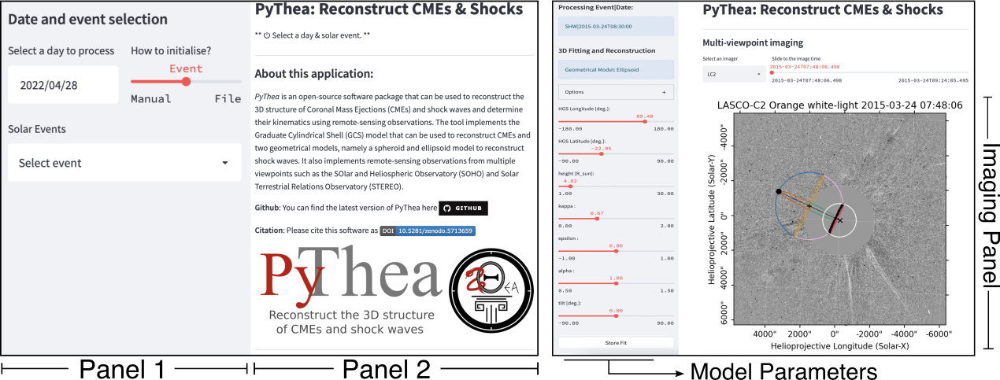
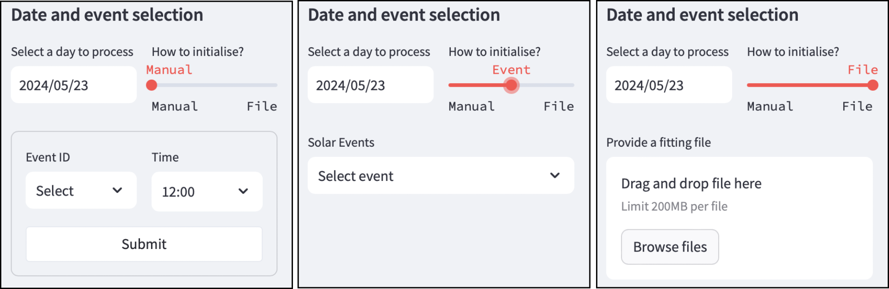
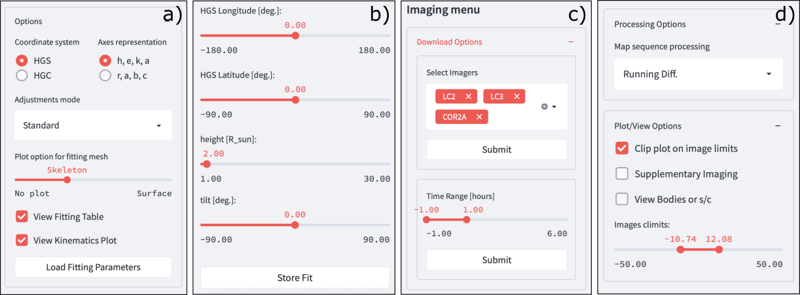
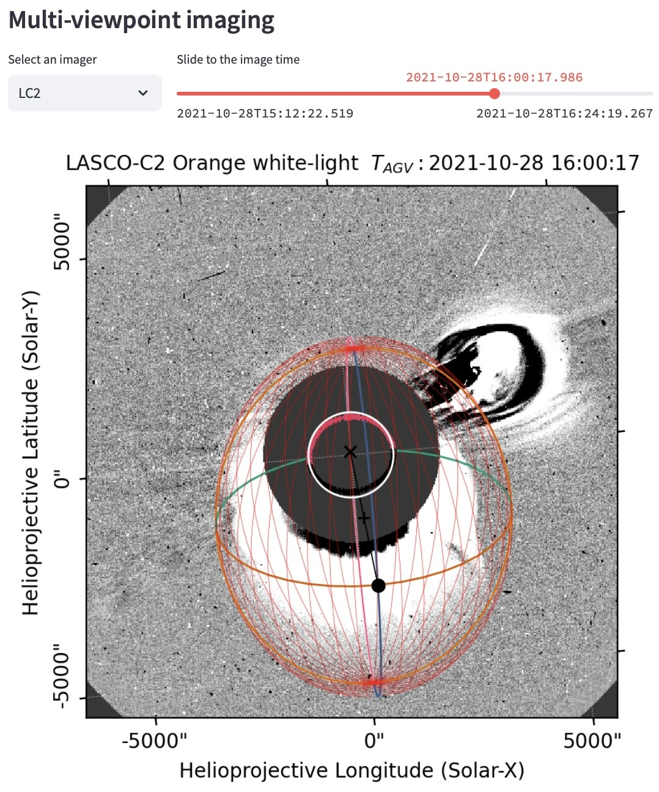
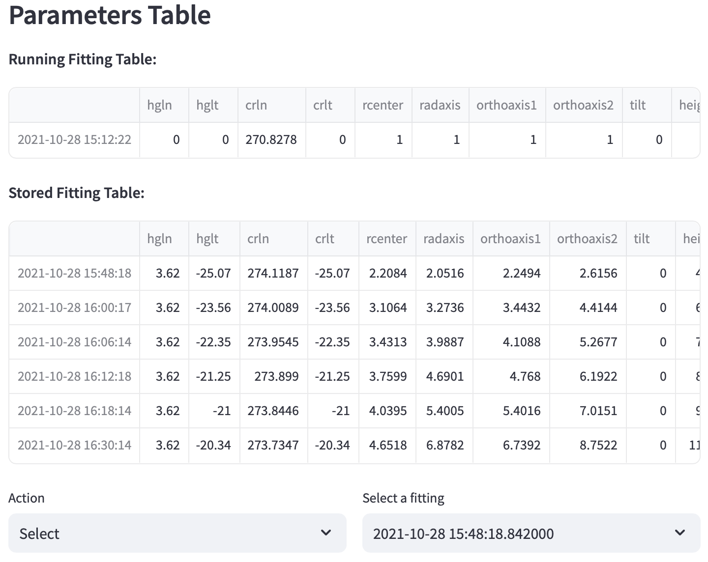
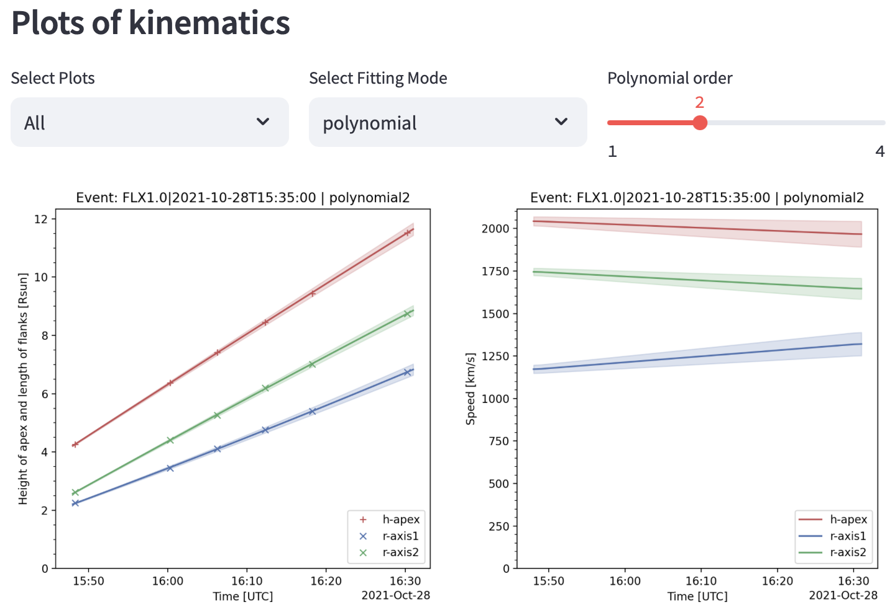

PyThea Application
==================

The Graphical User Interface
----------------------------

Performing a 3D reconstruction is mainly an interactive process. To reconstruct an event, the user aims to achieve the best fit of a geometrical model to multi-viewpoint coronal observations by adjusting a set of geometrical parameters. However, without a graphical user interface (GUI), this process becomes nearly impossible. PyThea provides a modern solution for conducting comprehensive analyses of events. Its user-friendly GUI, built on Streamlit, facilitates efficient interaction with the reconstruction process.

The PyThea web application comprises two main pages as shown in :numref:`main-app-page`. The starting page (left panel) appears when running the application for the first time. On this page, the user can initiate the fitting process by selecting the date of the event and the fitting model to be used. Then the application initiates and a second page is loaded with the fitting sliders and the imaging views. Each main page comprises two primary vertical panels as shown in :numref:`main-app-page`, namely Panel 1 and 2. The left panel serves as a hub for your input widgets, allowing the user to interactively change the parameters and control the reconstruction process. On the other hand, the right panel is dedicated to displaying data elements, providing a visual feedback on the reconstruction results. This separation of input and output elements enhances the usability and clarity of the application interface, enabling you to navigate through the reconstruction process with ease. In essence, PyThea revolutionizes the 3D reconstruction workflow by combining advanced algorithms with intuitive interface design, making complex analyses accessible to a broader audience.

   Two views of PyThea‘s web application. The left panel shows the starting page of the application and the right panel shows the main fitting page.

Starting page
-------------

When the application runs for the first time, the starting page appears and the user have to select the date and event to process and the geometrical model to use. A view of the starting page is shown in :numref:`main-app-page`. For the selection of the date and event selection, three options are available to initiate the fitting process we show at the three panels of :numref:`main-app-page-select`. With the 'Event' mode (middle panel) the user can select a date and a solar flare event associated with the event that will perform the geometrical fitting. If the CME or shock do not have an associated flare then there is a second 'Manual' option (left panel). With this option, the user can select the date and the event (CME, shock, flare). For these two modes, the next step is to select the geometrical model for the fitting process. A third option is to provide a fitting JSON file and the application will initiate with the fitted event and the selected geometrical model (right panel). In this case, the fitted parameters are loaded in the fitting table (see below) and the user can preview and continue the fitting. After the above selections, the application will search and download available data and the main geometrical fitting page will appear.

   Selection panels at the starting page.

Main Geometrical Fitting Page
-----------------------------

When the main geometrical fitting page appears the user can start the fitting process. In this page, the user can adjust the parameters of the geometrical model, change the images and the selected imager, and select among various visualization options. An example of the main geometrical fitting page is shown in :numref:`main-app-page` (right panel).

Widgets Panel
~~~~~~~~~~~~~

The user can easily customize the visualization using various input widgets found on the left panel of this page. From sliders to radio buttons and drop-down menus, these widgets offer a range of options for visualizing the data, adjusting fitted parameters, selecting specific images, and performing image processing tasks. An example of the different options is shown in :numref:`app-slider-details`.

In the first container (panel a), there are options related to the coordinate system and axis representation for fitting parameters, visualization options for the model, as well as, visualization of the fitting table and kinematics. Switching between coordinate systems allows the user to specify model coordinates in Carrington or Stonyhurst systems, offering flexibility in the analysis. Changing the coordinate system of the geometrical model the user can provide the longitude and latitude of the model in Carrington or Stonyhurst coordinates. Similarly, the axis representation provides alternative ways to input geometrical parameters for the model. The user can also select whether to display the full mesh or just the skeleton of the geometrical model within the images. Additionally, the 'View Fitting Table' and 'View Kinematics Plots' options will show the fitting table containing the geometrical parameters and kinematic plots resulting from the fittings, respectively. These features provide comprehensive insights into the fittings and the kinematics of the model during the analysis.

   These panels show an example of the input widgets that can be used to provide input parameters to the application.

The next container has the sliders with the geometrical parameters. Adjusting the parameter values of the geometrical model will update its view at the selected imager to the new state. Adjust the parameters until there is a good fit of the model to the CME or shock wave that appears on the images. When the fitting is ready the user can store it to the fitting table by pressing the 'Store Fit' button. Storing a new fit to the table will update the table and the kinematic plots. If the fitting for the selected time and image already exists in the table then the values will be updated.

The 'Imaging menu' (panel c) provides options to select more imagers and download and load the imaging data. With the 'Time Range' slider the user can extend the time interval of the image loading. The preselected time interval is one hour before and after the flare maximum of the time selected with the manual mode. The user can also select among three different image processing options in panel c, namely running and base difference images, and plain images. There is also an option to clip the geometrical model on the image limits. Additionally, the option of 'Supplementary Imaging' visualizes two near-simultaneous images from other imagers. This can be used to perform triangulation and tight constrain the geometrical model using multi-viewpoint images. The image's climits slider provide also the option to change the colourmap limits of the images shown.

Imaging and Results Panel
~~~~~~~~~~~~~~~~~~~~~~~~~

The right panel of the main geometrical fitting page is the imaging panel. Here appear the images for the selected imager with the geometrical model overlaid onto the images. The user can select the imager to visualize the available data from a drop-down menu and also use a slider to select the different times of the images. Additionally, if the 'Supplementary Imaging' has been selected two nearly co-temporal images from other instruments will appear. The user can use the slider on the bottom of the two images to select among the different loaded imagers. In this panel, the fitting table and the kinematic plots can appear on the bottom of the images, if these options have been selected. We give more details in the following Section.

   An example of the imaging panel.

Fitting Parameters Table Section
--------------------------------

When enabling the ‘View Fitting Table’ a section with the fitting parameters appears in the imaging panel below the imaging section. An example of this section is shown in :numref:`app-fitting-table-details`. This section shows two fitting parameters tables: at the top is the ‘Running Fitting Table‘ and at the bottom is the ‘Stored Fitting Table'. The ‘Running Fitting Table‘ provides the fitted parameters of the geometrical model to the selected image. These parameters will be stored when the user presses the ‘Store Fit‘ button. The ‘Stored Fitting Table' provides all the fitted parameters of the geometrical model to the various images. The information in this table updates when a new single fitting is stored. The parameters stored in this table can be downloaded in a JSON file when the overall fitting of an event is ready from the ‘Finalize and save results‘ section by pressing the ‘Download Fitting as .json file‘.  Additionally, the user can load the fitting parameters from any of the single fittings (i.e. rows) or delete any record from the ‘Store Fit‘ selecting first the fitting record from the ‘Select a fitting‘ drop-down menu and then using the ‘Action‘ drop-down menu.

   A view of the ftting table in the application

Kinematic Plots Section
-----------------------

When enabling the ‘View Kinematics Plot’, a section with the kinematic plots appears in the imaging panel below the imaging section (or the’Fitting Table’ section if enabled). An example of this section is shown in :numref:`app-kinematics-plots-details`. The user can select from a drop-down menu different visualization options, such as plotting the height-time and speed-time kinematic plots. Additionally, the user can select the fitting method, such as polynomial, spline fit, or a custom function. Depending on the fitting method additional sliders appear with fitting options like the polynomial order, the spline order and smooth value.

   A view of the kinematic plots in the application
