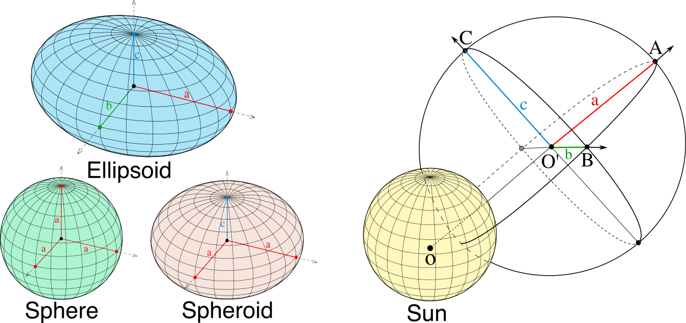
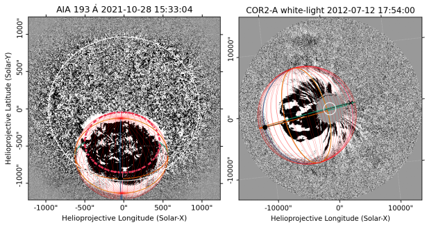

.. _geometrical_models:

Geometrical Models
==================

Ellipsoid and Spheroid Models
-----------------------------

The ellipsoid or spheroid models are usually used to reconstruct shock waves in 3D. CME-driven shock waves in the corona can be observed as propagating fronts in white-light and extreme ultraviolet. These fronts has been suggested to form the halo envelope of CMEs, so that the outermost halo front part of the CMEs is formed by the propagating shock wave rather than a projection of the CME ejecta. In 3D, the ellipsoid model seems a rather good approximation to describe the global large-scale structure of the WL shocks. Additionally, a simpler spheroid model can also be used, when it is better to perform the fitting with a reduced complexity.

An ellipsoid is a quadratic closed surface in which all plane cross-sections are either ellipses or circles. It has three mutually perpendicular axes of symmetry that intersect at a center of symmetry, which we will call hereafter the center of the ellipsoid. The three line segments along the axis of symmetry that start from the center of the ellipsoid and end at its surface are called the principal semi-axes of the ellipsoid, and they correspond to the semi-major axis and semi-minor axis of the plane cross-section ellipses. The implicit equation of an ellipsoid in the Cartesian coordinate system is :math:`\frac{x^2}{a^2} + \frac{y^2}{b^2} + \frac{z^2}{c^2} = 1`, where :math:`a`, :math:`b`, and :math:`c` are the lengths of the three principal semi-axes. In :numref:`fig-ellipsoid-model`, we show an ellipsoid with the three axes of symmetry and the three principal semi-axes.

   Examples of the ellipsoid and spheroid models with the different axes labeled.

To define the ellipsoid model, we use three positional and three geometrical parameters. The point of reference for the ellipsoid (and spheroid) model is the center of symmetry. In PyThea, this point is represented as a SkyCoord in the HGS coordinate system. In the spherical coordinates, the three positional parameters, :math:`r_{center}`, :math:`\phi`, :math:`\theta`, define the heliocentric distance, latitude, and longitude of the ellipsoid center, respectively. Additionally, we define the primary (first) semi-axis of the ellipsoid model to start from the ellipsoid center and pointing radially outward towards the same direction as the position vector of the ellipsoid center. The other two semi-axis are orthogonal to the primary semi-axis, and their direction depends on the tilt angle, :math:`\gamma`, relative to the solar equator. For :math:`\gamma=0`, one of the semi-axis is coplanar with the solar rotation vector, and the other semi-axis is parallel to the solar equatorial plane. Note that for the spheroid model the tilt angle is not defined since any rotation along the radial semi-axis is trivial as there is a circular symmetry with respect to this axis.

The geometrical parameters of the ellipsoid model are the lengths :math:`a`, :math:`b`, and :math:`c` of the three principal semi-axes (two in the case of the spheroid), respectively. The positional and geometrical parameters are sufficient to fully define the geometry of the ellipsoid model in 3D. PyThea‘s users can adjust the :math:`\phi`, :math:`\theta`, and :math:`\gamma` values to match the position and orientation of the ellipsoid with the observed shock in white-light and extreme ultraviolet, and the length of the three principal semi-axes to fit the geometry of the shock front in every direction. The ellipsoid model can also be constrained to expand self-similarly. This provides a more convenient way to perform the shock fittings. In this case, the positional and geometrical parameters have to be defined differently. Instead of using the length of the three semi-axes as the geometrical parameters, the user adjust the heliocentric height of the ellipsoid at the apex, and the length of the other two semi-axis are calculated using a self-similar constant (:math:`\kappa`), an aspect ratio (:math:`\alpha`), and the eccentricity (:math:`\epsilon`) of the ellipsoid defined from the cross-sectional ellipse of two semi-axis. Changing :math:`r_{apex}` and keeping constant the other parameters, the expansion is self-similar. The :math:`\kappa` parameter is defined as the ratio of the height of the apex to the length of one of the semi-axis (:math:`\kappa = b / r_{apex} - 1 R_\odot`). This value is proportional to the aspect ratio between the two semi-axis :math:`a` and :math:`b`. The OA line segment shown in :numref:`fig-ellipsoid-model`, is the height of the apex, so :math:`r_{apex} = OA = r_{center} + \alpha`. The :math:`\alpha` parameter is the second aspect ratio of the ellipsoid, and it is defined as :math:`\alpha = b/c`, while :math:`\epsilon` is the eccentricity, and we define it as follows:

.. math::

   \epsilon = \begin{cases}
       \sqrt{1 - \frac{a}{b}} & \text{if } a < b \\
       -\sqrt{1 - \frac{b}{a}} & \text{if } a > b
   \end{cases}

Any of the above four geometrical parameters :math:`r_{apex}`, :math:`\kappa`, :math:`\alpha`, and :math:`\epsilon` and positional parameters, :math:`\phi`, :math:`\theta`, and :math:`\gamma`, can be adjusted to fit the ellipsoid model to the observed shock front in the white-light and extreme ultraviolet images. An example of the ellipsoid fitting to SDO/AIA and SOHO/LASCO images is shown in :numref:`fig-ellipsoid-fitting_AIA_LASCO`.

   An example of the fitted ellipsoid model to running difference images white-light and extreme ultraviolet images from SDO/AIA and SOHO/LASCO, respectively.

In the case where the three semi-axes of the ellipsoid are equal (:math:`a=b=c`), the surface is a sphere, and if only two semi-axes are equal, the surface is an ellipsoid of revolution, or most commonly called a spheroid. The two cases are also presented in :numref:`fig-ellipsoid-model`. Then, a spheroid is obtained by revolving an ellipse about one of its principal axes, and it has a circular symmetry. When revolving the ellipse about its minor (major) axis, an oblate (prolate) spheroid is formed. Therefore, a spheroid is oblate (prolate) when :math:`a` and :math:`b` are equal and also are greater (smaller) than :math:`c`. The possitional parameters of the spheroid are the same as the ellipsoid, except for the tilt angle (:math:`\gamma`) which is redundant for the spheroid. For the geometrical parameters, since :math:`b` and :math:`c` are equal the aspect ratio (:math:`\alpha`) is the only redundant parameter, whereas, the other parameters are the same.
