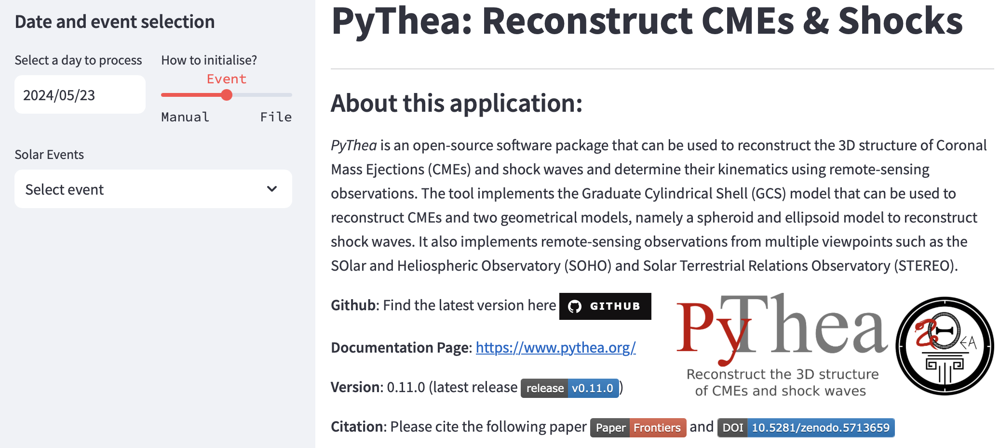

.. _runnig-pythea:

Run the Application
===================

After installing ``PyThea`` software package, you can run the application using the terminal.

Activate the enviroment and then run ``PyThea`` using the following,

.. code-block:: bash

  PyThea streamlit

The application will open in the default browser.

Deactivate the environment when you finish your work.

.. code-block:: bash

  # When you are done you can deactivate the virtual environment
  conda deactivate
