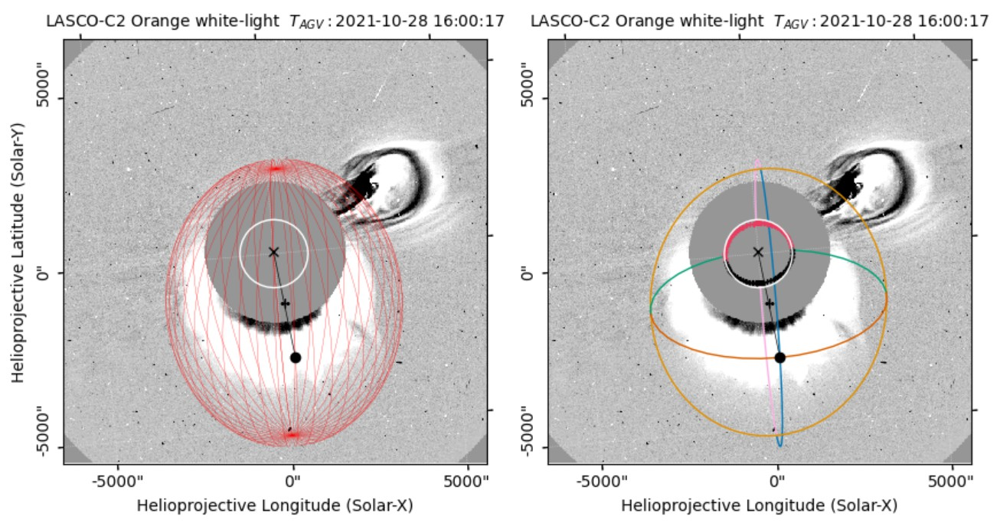

.. _utilities:

Utilities
=========

PyThea includes several utilities that facilitate various tasks without requiring inputs from the Streamlit components. Therefore these functions can be used outside of the main application allowing the user to leverage some of PyThea's functionality without relying on the main application interface. Most of the utilities focus on data processing and visualization. Bellow there a few examples that show how to use the utility fucntions to download, process and plot imaging data from various instruments, load and process JSON fitting files, and analyze kinematic data. This last feature is particularly useful for users who need to perform detailed kinematic analysis without engaging the main application and produce their final figures for publication. Many of these utility functions are also demonstrated through examples available in the example section of the documentation. These examples provide step-by-step guidance on how to effectively use the utilities for various tasks.

Imaging data
------------

This section introduces the utilities related to the imaging download, process, and virtualization and provides details of how the imaging data are managed within PyThea.

PyThea utilizes remote sensing data from several spacecraft and various imagers on board heliospheric missions that continuously collect solar imaging data.The available imagers are specified in the ``selected_imagers.py`` configuration file. Each imager has several configuration options used in the data downloading and processing pipeline. These configurations are stored in the ``selected_imagers.imager_dict`` which is a dictionary.

To retrieve the list of available imagers and their corresponding keys, use the following script:

.. code-block:: python

    >>> from PyThea.config import selected_imagers

    >>> for key in selected_imagers.imager_dict.keys():
    >>>     imager = selected_imagers.imager_dict[key]
    >>>     detector_or_wavelenght = imager['detector'] if 'detector' in imager else imager['wavelength']
    >>>     print(f'{imager["source"]}/{imager["instrument"]}-{detector_or_wavelenght}:  {key}')

The ``imager_dict`` is a dictionary where each primary key is a short label for a selected imager. These short labels are used in the fitting process as identifiers for the selected imagers and the information stored in the JSON fitting file. For each imager, ``imager_dict[key]`` is another dictionary containing definitions for the download and processing pipeline. For example, ``imager_dict['LC2']['fido']`` is a list of parameters used by SunPy's Fido function to download data from LASCO instrument and C2 detector and ``imager_dict['LC2']['process']`` provides the imaging processing configuration details of which are shown bellow.

For the first iteration (where key='LC2'), the script will print:

.. code-block:: python

    SOHO/LASCO-C2:  LC2

Download and load fits files
~~~~~~~~~~~~~~~~~~~~~~~~~~~~

To download imaging data for a selected imager you can use the ``download_fits`` utility. The ``download_fits`` utility uses SunPy's ``Fido`` which is a unified data search and retrieval interface (see details in `Fido <https://docs.sunpy.org/en/stable/tutorial/acquiring_data/>`_). The function requires two inputs from the user, first is the time range of the imaging query and second is the key of the selected imager. The time range is a search attribute from ``sunpy.net.attrs`` that defines the start and end time of the query, for example ``attrs.Time('2021-10-28T15:30:00', '2021-10-28T15:30:00')``. The code below will download LASCO-C2 fits files for the selected time range:

.. code-block:: python

    >>> from sunpy.net import attrs as a
    >>> from PyThea.utils import download_fits

    >>> imager = 'LC2'
    >>> timerange = a.Time('2021-10-28T15:30:00', '2021-10-28T17:30:00')
    >>> files = download_fits(timerange, imager)

In this example, ``Fido`` searches and downloads imaging data from LASCO-C2 from the Virtual Solar Observatory using the attributes that are defined in the ``imager_dict['LC2']['fido']``. For LASCO-C2 the ``imager_dict['LC2']['fido']`` list of atributes define only the instrument (``a.Instrument.lasco``) and the detector (``a.Detector.c2``). For other imagers the list of attributes maybe more extended. For example, the ``imager_dict['LC2']['fido']`` for the SDO/AIA imager contains also the attributes for wavelength (``a.Wavelength(19.3 * u.nm)``) and sample rate (``a.Sample(1*u.minute)``) to be used in the data query.

The fetched fits files from this downloading process are stored in PyThea's database directory which is pre-configured to be the ``os.path.join(Path.home(), 'PyThea')`` directory. Then the imaging data are stored in the ``\data`` directory with the following sub-directory structure for each imager: ``{imager_prop["source"]}/{imager_prop["instrument"]}/{sub_path}``, where the ``sub_path`` is either ``imager_prop['detector']`` or ``imager_prop['wavelength']`` depending on the imager.

To load the fits files in a sequence of SunPy maps use the ``load_fits`` utility as shown in the code bellow:

.. code-block:: python

    >>> from PyThea.utils import load_fits

    >>> maps = load_fits(flies)

The ``load_fits`` utility checks if all the fits files can be loaded in a SunPy ``Map`` and if errors are detected then it removes the file. These errors may occur because, on rare occasions, some fits files are downloaded corrupted and the loading process fails. The returned ``maps`` are ``sunpy.map.MapSequence`` which is a series of Maps in a single object.

In the 'Gallery of Examples', you can find an example of the above downloading and loading process.

Process fits files
~~~~~~~~~~~~~~~~~~

The next step is to process the loaded maps using the ``single_imager_maps_process`` utility. This function filters, prepares, and processes the maps. The ``single_imager_maps_process`` takes as input the laded maps and options for the maps processing and returs the processed maps as ``sunpy.map.MapSequence``. The default options for the maps processing can be found in ``imager_dict[imager]['process']``, for each imager.

.. code-block:: python

    >>> from PyThea.config import selected_imagers

    >>> imager = 'LC2'
    >>> print(selected_imagers.imager_dict[imager]['process'])

.. code-block:: python

    {'dimensions': (<Quantity 1024. pix>, <Quantity 1024. pix>), 'polar': 'Clear', 'superpixel': 2}

According to the code above, the default configuration for the image processing of LASCO-C2 maps filters out images with dimensions other than 1024x1024, images that are not total brightness images and resamples the images to half the original dimension. The user can provide a different configuration than the default one, however, it is not advisable to change the configuration for any imager when running the application.

The image processing in ``single_imager_maps_process`` utility consists of three different processing steps:

* Filters the Maps (``filter_maps``)

The map filtering uses the ``filter_maps`` function which is a part of the ``maputils`` utilites. With this function, the Maps can be filtered based on their exposure time, data dimension, and polarization (for white-light images).

* Prepare the Maps (``prepare_maps``)

With ``prepare_maps`` function, which is also a part of the ``maputils`` utilities, the Maps are prepared from their standard level to a higher level. These preparations include various calibrations and corrections, such as pointing, observer location, exposure time corrections and the preparation of polarization images into total brightness images. Then the Maps are normalized to their exposure time and if the images are coronagraphic the occulter is masked. Finally, the Maps are resampled with the SunPy's ``superpixel`` method.

* Process the sequence (``maps_sequence_processing``)

The final prepared Maps can be processed into running/base difference or plain image sequence maps using the ``maps_sequence_processing`` function which is part of the ``maputils`` utilities as well.

The code below gives a small example of how the ``maps_sequence_processing`` function is being used.

.. code-block:: python

    >>> from PyThea.utils import single_imager_maps_process

    >>> processed_images = single_imager_maps_process(maps,
                                                      **selected_imagers.imager_dict[imager]['process'],
                                                      image_mode='Running Diff.',
                                                      diff_num=1)

Plot Imaging Data
-----------------

PyThea's utilities can also be used to plot the imaging data from the processed_images. This can be done using ``make_figure`` function and providing one of the processed Maps from the loaded sequence. The function makes a figure and axis, plots the selected image and the solar limb, prepares the axis and uses different colormaps depending if the image mode is plain or running/base difference images. The code below shows how the ``make_figure`` function is used:

.. code-block:: python

    >>> from PyThea.utils import make_figure

    >>> fig, ax = make_figure(processed_images[0], 'Running Diff.', clim=[-20, 20], clip_model=True)
    >>> plt.show()

Using the ``clim`` keyword argument the user can provide the values of the colormaps limits for the image ploting. This can improve the image contrast and therefore the visibility of the different features. Additionally, the user can select if the figure will be clipped at the image limits using the ``clip_model`` function. This is particularly useful when there is an overplot of the geometrical model and the model lies outside of the image axis. The user can also provide a custom figure and axis handle using the ``fig`` and ``axis`` keyword arguments.

Overploting a geometrical model
~~~~~~~~~~~~~~~~~~~~~~~~~~~~~~~

To over-plot a geometrical model to an image, the user can either construct the model using the corresponding class or to use the ``model_fittings`` utility function. In the second case, the model parameters are loaded from a fitting file and then selecting the fitting that corresponds to the viewed image, the model is constructed from the corresponding class providing the fitted parameters. In the example code below, an ellipsoid model is manualy constructed by providing the geometrical parameters directly to the model class. Then the geometrical model is ploted to the axis using the model's plot function.

.. code-block:: python

    >>> import astropy.units as u
    >>> from astropy.coordinates import SkyCoord
    >>> from sunpy.coordinates import frames
    >>> from PyThea.utils import make_figure
    >>> from PyThea.geometrical_models import ellipsoid

    >>> obstime = '2021-10-28 16:00:17.986000'
    >>> center = SkyCoord(3.62*u.degree, -23.56*u.degree, 3.106424*u.R_sun,
                          obstime=obstime,
                          observer='earth', frame=frames.HeliographicStonyhurst)
    >>> model_shock = ellipsoid(center, 3.273576*u.R_sun, 3.4432*u.R_sun, 4.414359*u.R_sun, 0 * u.degree)
    >>> fig, ax = make_figure(processed_images[0], 'Running Diff.', clim=[-20, 20], clip_model=True)
    >>> model_shock.plot(ax, mode='Full')
    >>> plt.show()

With the ``mode`` keyword argument the can select to either visuallize the full mesh of the points of the ellipsoid (``mode='Full'``) or just the skeleton of the model (``mode='Skeleton'``). An example is shown in :numref:`ellipsoid_full_vs_skeleton`.

   An example of the ellipsoid model over-ploted to a LASCO-C2 image. The left panel show the full ellipsoid structure and the right panel show only the main skeleton.

Load fitting files
------------------

PyThea's application provides an option to save the results into a fitting file in JSON format. This file contains the geometrical parameters for every image fitting and other information about the fitting process performed. Using ``model_fittings`` utility class, the user can load the results into the class and construct the geometrical model for every individual fitting. Below is a code example that shows how to use this utility.

.. code-block:: python

    >>> from IPython.display import display
    >>> from PyThea.data.sample_data import json_fitting_file_sample_data
    >>> from PyThea.utils import model_fittings

    >>> json_fitting_file = json_fitting_file_sample_data.fetch('FLX1p0D20211028T153500MEllipsoid.json')
    >>> model_fittings_class = model_fittings.load_from_json(json_fitting_file)
    >>> print(f'Selected Event: {model_fittings_class.event_selected}')
    >>> print(f'Geometrical Model: {model_fittings_class.geometrical_model}')
    >>> display(model_fittings_class.parameters)

    Selected Event: FLX1.0|2021-10-28T15:35:00
    Geometrical Model: Ellipsoid
                             hgln   hglt        crln   crlt  ...  kappa  epsilon  alpha  imager
    2021-10-28 15:48:18.842  3.62 -25.07  274.118677 -25.07  ...   0.69    -0.41   0.86     LC2
    2021-10-28 16:00:17.986  3.62 -23.56  274.008914 -23.56  ...   0.64    -0.31   0.78     LC2
    2021-10-28 16:06:14.730  3.62 -22.35  273.954464 -22.35  ...   0.64    -0.24   0.78     LC3
    2021-10-28 16:12:18.325  3.62 -21.25  273.898969 -21.25  ...   0.64    -0.18   0.77     LC2
    2021-10-28 16:18:14.323  3.62 -21.00  273.844633 -21.00  ...   0.64    -0.02   0.77     LC3
    2021-10-28 16:30:14.364  3.62 -20.34  273.734733 -20.34  ...   0.64     0.20   0.77     LC3

    [6 rows x 14 columns]

The script imports a sample JSON fitting file using ``json_fitting_file_sample_data.fetch()`` method. The sample data file contains a series of fitted ellipsoids for a selected event. The ``model_fittings.load_from_json(json_fitting_file)`` loads the model fittings from the JSON file. The result is stored in the ``model_fittings_class`` variable. The user can print the information about the selected event and geometrical model using ``print()`` statements and the parameters of the model fittings using ``display()`` of the ``model_fittings_class.parameters`` where all the fitting parameters are stored.

Then the user can construct the geometrical model for a single fit using the ``model_fittings_class`` as shown earlier. The loaded geometrical model is an ellipsoid so the user has to use this model class and input the geometrical parameters. An example code is shown below.

.. code-block:: python

    >>> model_parameters = model_fittings_class.parameters.iloc[1]

    >>> obstime = model_parameters.name

    >>> center = SkyCoord(model_parameters['hgln']*u.degree,
                          model_parameters['hglt']*u.degree,
                          model_parameters['rcenter']*u.R_sun,
                          obstime=obstime, observer='earth',
                          frame=frames.HeliographicStonyhurst)

    >>> model_shock = ellipsoid(center,
                                model_parameters['radaxis']*u.R_sun,
                                model_parameters['orthoaxis1']*u.R_sun,
                                model_parameters['orthoaxis2']*u.R_sun,
                                model_parameters['tilt']*u.degree)

From the ``model_fittings_class.parameters`` table, a single fit (second) is selected and stored in the ``model_parameters`` variable. The fitting time (i.e. the time that the fitted shock is observed) can be found from the ``model_parameters.name`` value. Before constructing the ellipsoid geometrical model the center of the model has to be defined. This can be done using SunPy's ``SkyCoord``. The coordinates of the ellipsoid center are the ``hgln``, ``hglt``, and ``rcenter`` variables in the ``model_parameters``. These coordinates are in the Heliographic Stonyhurst coordinate system. The ellipsoid can be constructed from the center and the three geometrical parameters ``radaxis``, ``orthoaxis1``, ``orthoaxis2``, and ``tilt`` are also variables in the ``model_parameters``. Parameters with angular values are in degrees and length values are stored in solar radii.
